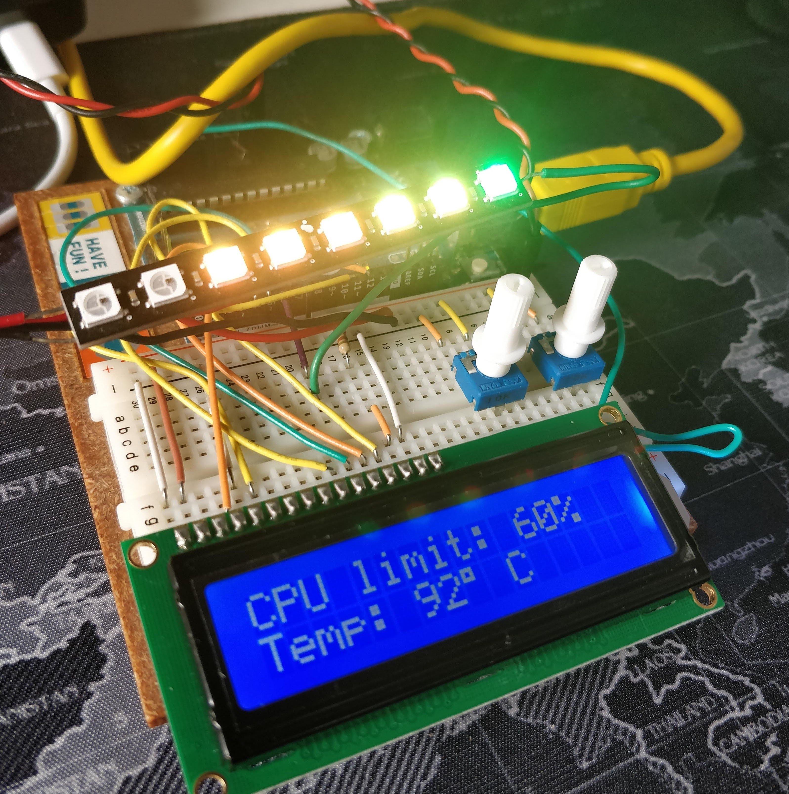

# Arduino MacOS Thermlog

This was a pet project to monitor my Macbook's CPU thermal throttling in real time through an LCD screen and a NeoPixel strip as indicator.

I don't have much idea about Arduino, electronics or NodeJS. But I thought it would be fun to make the project and publish the code anyway.

